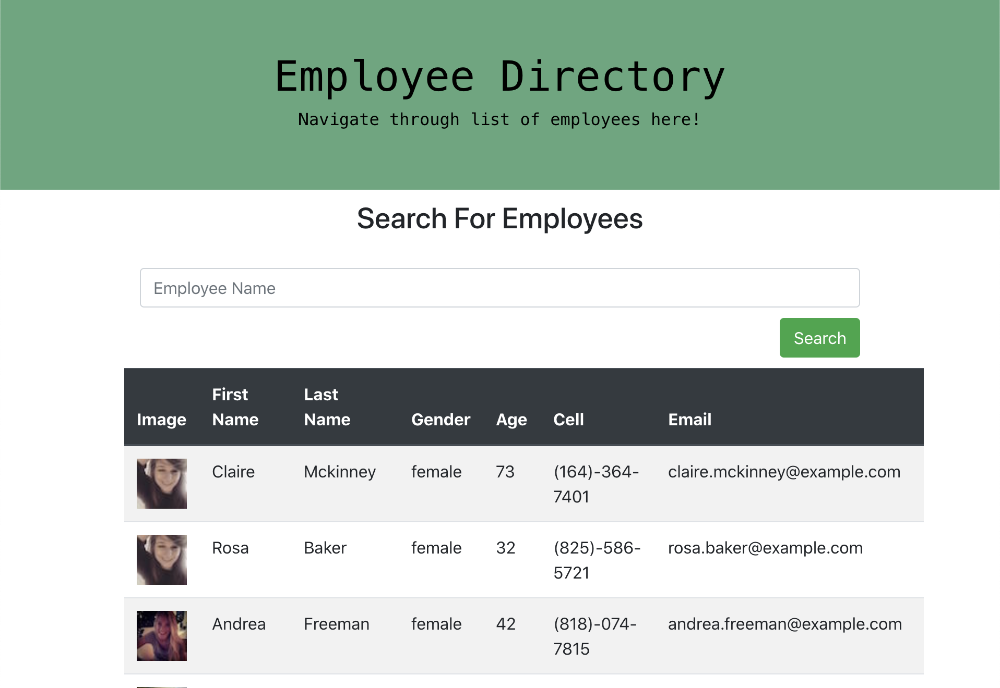

# React Employee Directory  

## Introduction  

I created a react website that can be used to sort through a list of employees by name. This was my first app ever using ReactJS.

## Objectives  

```
As a user, I want to be able to view my entire employee directory at once so that I have quick access to their information.  

As a user, I want to be able to view non-sensitive data about other employees. It would be particularly helpful to be able to filter employees by name.
```

## Challenges  

This app was pretty tough to create considering it was my first time using React and I am fairly new to it. I had a lot of trouble deploying this application to Heroku because of errors with my build and dependencies. Still was unable to figure out where I went wrong so I created a new repository and changed nearly every file in order for it to work properly. Through the challenges of the application not working I learned so much. it wasn't the funnest way to learn React, but it was effective.  

## Website

* [Link to deployed Heroku Website](https://afternoon-reaches-35223.herokuapp.com/)  

## Screenshots  

  